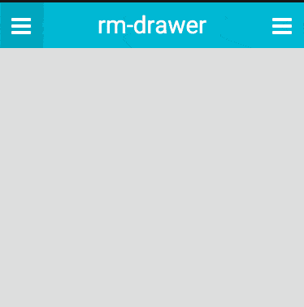

<h1 align="center">react-motion-drawer</h1>

<p align="center">

  <a href="#example">Example</a> |
  <a href="#usage">Usage</a> |
  <a href="#api">API</a> |
  <a href="CHANGELOG.md">Changelog</a>
  <br><br>
  
</p>

> Navigation drawer built with the awesome [react-motion][rm] by [@chenglou][c] and [react-hammerjs][rh] by [@JedWatson][j]

[](https://badge.fury.io/js/react-motion-drawer)

## Example

A live demo is available [here](https://react-motion-drawer.netlify.com/)!

To run the example locally, run:
```bash
$ yarn
$ yarn serve
```

## Installation

Via npm:
```
npm install react-motion-drawer
```

## Usage

```js
import Drawer from 'react-motion-drawer';
```

```jsx
  <Drawer open={false} onChange={onChange}>
    <ul>
      <li>Home</li>
      <li>About</li>
      <li>Settings</li>
    </ul>
  </Drawer>
```

If you want the drawer on the right side of the screen you need the following css.

```css
  body {
    overflow: hidden;
  }
```

### Hooking into the animation

You can hook into the animation by passing a function as the child component.

```jsx
  <Drawer open={false} width={300} onChange={onChange}>
    { val =>
      <ul style={{ opacity: 300 / val }}>
        <li>Home</li>
        <li>About</li>
        <li>Settings</li>
      </ul>
    }
  </Drawer>
```

## API

### Props

* `zIndex: number`           - z-index of the drawer (default `10000`)
* `noTouchOpen: bool`        - can a user pan to open (default `false`)
* `noTouchClose: bool`       - can a user pan to close(default `false`)
* `onChange: func`           - called when the drawer is open (default `() => {}`)
* `drawerStyle: object`      - additional drawer styles
* `className: object`        - additional drawer className
* `overlayClassName: object` - additional overlay className
* `config: object`           - configuration of the react-motion animation (default `{stiffness: 350, damping: 40}`)
* `open: bool`               - states if the drawer is open (default `false`)
* `width: number`            - width of the drawer (default `300`)
* `height: number`           - height of the drawer (default `'100%'`)
* `handleWidth: number`      - width of the handle (default `20`)
* `peakingWidth: number`     - width that the drawer peaks on press (default `50`)
* `panTolerance: number`     - tolerance until the drawer starts to move (default `50`)
* `right: bool`              - drawer on the right side of the screen (default `false`)
* `overlayColor: string`     - color of the overlay (default `rgba(0, 0, 0, 0.4)`)
* `fadeOut: bool`            - fade out (default `false`)
* `offset: number`           - offset of the drawer (default `0`)

## License

MIT © [Christoph Hermann](http://stoeffel.github.io)

[rm]: https://github.com/chenglou/react-motion
[rh]: https://github.com/JedWatson/react-hammerjs
[c]: https://github.com/chenglou
[j]: https://github.com/JedWatson
